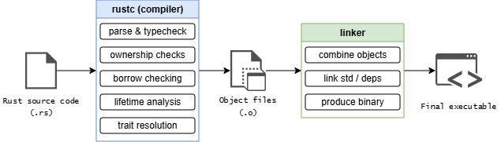

---

slug: /intro
sidebar_position: 1
---

# Ch 1 - Getting started

Welcome — this is **my personal Rust knowledge base** built while working through **_The Rust Programming Language (2021 Edition)_**.

It’s mainly designed for **my understanding** — a quick place to collect notes, mental models,
and occasionally over-specific details that I personally find useful.

### Installing rustup on Linux or macOS

Open a terminal and run the following command:
```
curl --proto '=https' --tlsv1.2 -sSf https://sh.rustup.rs | sh
```

What you get from this installation:
- `rustc` — the Rust compiler
- `cargo` — Rust’s build system and package manager
- Toolchain management (stable / beta / nightly)


Once the installation completes, you should see:

```
Rust is installed now. Great!
```

To finish the setup, make sure Rust is added to your environment and verify the installation:
```
» . "$HOME/.cargo/env"                                                 
» rustc --version          
rustc 1.93.0 (254b59607 2026-01-19)
```

At this point, the Rust compiler (`rustc`) and Cargo are installed and ready to use.

> If you are working on a fresh machine and may not have a linker, be sure to install one using the commmand below:

For Linux: `apt-get install build-essential`

For macOS: `xcode-select --install`

--- 

### What is Cargo?

Cargo is the tool you will interact with most of the time when writing Rust.

It is responsible for:
- Creating new Rust projects
- Downloading and managing dependencies (**crates**)
- Building your project
- Running tests
- Invoking the compiler and linker for you

In practice, you almost never run `rustc` directly. Instead, you use commands like:
```
cargo build
cargo run
cargo test
```

Behind the scenes, Cargo orchestrates the entire build process.

---

### How Rust builds a program (compiler + linker)

Rust is a **compiled language** with a strong emphasis on compile-time correctness.
Compilation does not immediately produce a runnable program.


Instead, the process is split into **two distinct stages**:


---

#### 1. Rust compiler (`rustc`): correctness and code generation

Before anything can be linked, Rust code goes through an extensive compile-time pipeline handled by `rustc`.

<!-- [Ownership and Borrowing](@site/docs/ch3-ownership/ownership.md). -->
At a high level, `rustc` performs:
- **Parsing & type checking**: Ensures the program is syntactically valid and types are consistent. 
- **Ownership checks**: Verifies that every value has a clear owner and that ownership rules are respected.
- **Borrow checking**: Enforces Rust’s aliasing and mutability guarantees at compile time.
- **Lifetime analysis**: Ensures references never outlive the data they point to.
- **Trait resolution**: Determines which trait implementations apply at each call site.

Once these checks succeed, the compiler generates object files — compiled machine-code fragments that are not yet runnable on their own.

> At this point, Rust has proven that the program is memory-safe and well-typed, but it has not produced an executable yet.

---
#### 2. System linker: assembling the final program

After compilation, control is handed off to a system-level linker (e.g., `ld`, `lld`, or Apple’s linker)

The linker’s responsibilities are much narrower but essential:
- Combines object files
- Links in required libraries (such as the Rust standard library and system libraries)
- Produces the final executable binary

Only after linking does a runnable program exist.

---

One question could be: **Why Rust relies on a system linker**?

Rust deliberately relies on the platform’s linker rather than bundling one universally because:
- Different operating systems use different binary formats
(`ELF, Mach-O, PE`)
- System linkers integrate deeply with OS toolchains
- This allows Rust to produce native binaries that behave like first-class system programs

---

### Try Rust quickly

No setup required — this runs entirely in your browser.

<div className="rustPlayground">
  <iframe
    src="https://play.rust-lang.org/?edition=2021&code=fn%20main()%20%7B%0A%20%20println!(%22Hello%2C%20Rust!%22)%3B%0A%7D"
    height="520"
    loading="lazy"
    sandbox="allow-scripts allow-same-origin"
  />
</div>