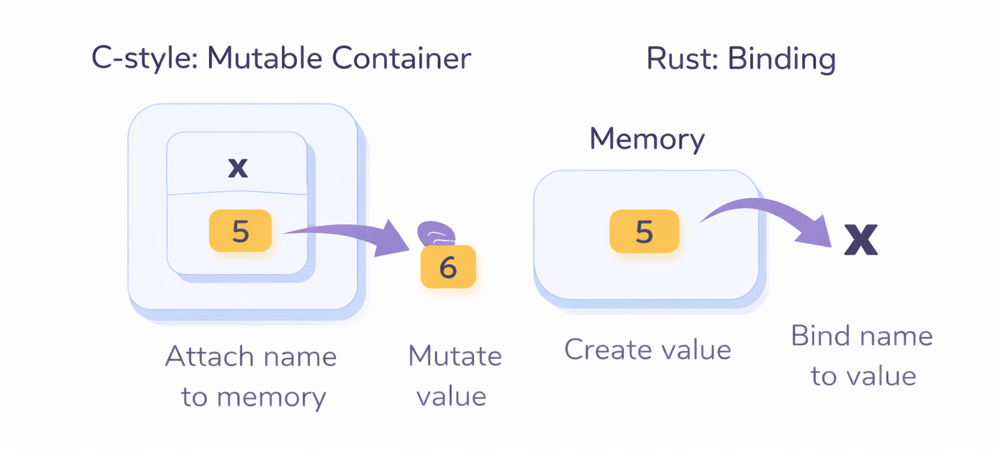
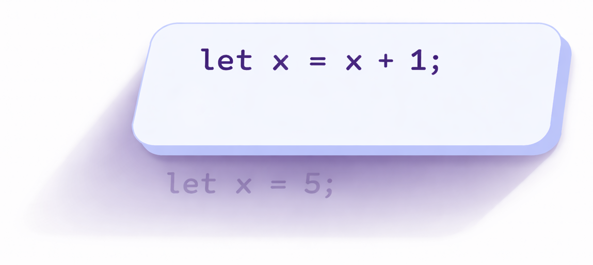

# Variables and Basic Types
---
## Variables and Mutability

### Variables

Rust variables look familiar, but Rust has a few important defaults and guarantees:
- **Bindings are immutable by default**
- Types are **known at compile time**
- The compiler enforces strict rules around how values are used


<details>
<summary><strong>
**Binding refresher**
</strong></summary>
In many languages, we casually say: “Assign a value to a variable”

However, in Rust, let does not mean “assign”.

It means:
> Bind a name to a value. In other words, a binding is the association between a name and a value.

When you write:
```rust
let x = 5;
```
Rust is doing two things:
1. **Creating a value** (`5`)
2. **Binding the name** `x` to that **value**



- The value (like `5`) lives in memory (stack, in this case). That memory location is very real at runtime.
- The name `x` lives in the compiler’s symbol table (the name is a compile-time binding), not as a runtime object. Tracked in the compiler’s internal data structures. Not something you can take the address of.

Notably:
- You are not creating a “box” that later gets overwritten
- You are not reserving memory and mutating it by default

You are simply saying:
> “For this scope, x refers to this value.”

---
**Why Rust avoids “assignment” by default**

In many languages:
```c
int x = 5;
x = 6;   // same variable, new value
```

This encourages thinking of variables as containers that change over time.

Rust intentionally flips that model:
```rust
let x = 5;
x = 6; // ❌ not allowed
```

Because x is a binding, not a mutable container.

If Rust allowed this by default, it would:
1. Complicate reasoning about aliasing
2. Make borrow checking far harder
3. Allow subtle bugs where values change unexpectedly

Instead, Rust asks you to be explicit.

</details>

```rust
let x = 5;
let mut y = 5;
```

### Constants

In contrast to variables, *constants* are:
- **Always immutable**
- Declared with the `const` keyword
- Required to have an explicit type annotation
- Must be initialized with a compile-time constant expression
- Scoped like any other name (they’re visible only within the scope they’re declared in)

```rust
const CONST_VALUE: u32 = 1337; 
// Convention: constants are usually SCREAMING_SNAKE_CASE
```

### Shadowing

We briefly mentioned shadowing earlier; here’s the precise idea.

Shadowing means declaring a **new binding** with the **same name** as an existing one.
The old binding still exists conceptually, but it is no longer accessible by name.

```rust
let x = 5;
let x = x + 1;
```

What’s important here is that:
- This is not **reassignment**
- **A new value** is created
- **A new binding** named `x` replaces the old one in the current scope

A helpful way of visualizing this (new `x` is overshadowing the first `x`):


<details>
<summary><strong>
What is the purpose of shadowing?
</strong></summary>

1. **Shadowing avoids mutation while allowing transformation**

With an immutable binding, reassignment is not allowed:
```rust
let x = 5;
x = 6; // ❌ not allowed (reassignment)
```
But creating a new binding **is** allowed:
```rust
let x = 5;
let x = x + 1; // ✅ allowed (new binding)
```
You’re not changing a value; you’re **binding the same name to a new value.**

2. **Transform a value while keeping the same “conceptual name”**
A common case is parsing user input:

```rust
let guess = "42";              // &str
let guess: u32 = guess.parse().expect("number"); // u32 (new binding)
```
Here:
- The first `guess` is a string slice
- The second `guess` is a number
- The name stays the same **because the idea (“the user’s guess”) stays the same**

This works because shadowing creates a new binding, not because Rust allows mutation.
</details>

---

## Basic Types

### Revisiting Type Inference

Similar to other programming languages, Rust also has a set of basic data types.

What’s important in Rust, however, is that **every value has a concrete type**, and that type must be known by the compiler at compile time.

Before moving forward, let’s briefly revisit type inference, which we’ve mentioned earlier.

A quick question; will this code work?

```rust
let guess = "42".parse().expect("Not a number");
```

<details>
<summary><strong>
The answer is...
</strong></summary>
No, because **Rust does not know what tpye you want to parse into**.
</details>

What does that mean?

Let’s take a closer look.

---

#### Why `let x = 5;` works
```rust
let x = 5;
```

Here, Rust **can** infer the type.

Because:
- Integer literals like `5` have a default type
- Rust defaults to `i32` when no other context is provided
- In other words, the literal `5` already carries enough information to reach into a default choice.

---

#### Why `parse()` is different

On the other hand,
```rust
"42".parse()"
```
doesn't work because, the signature of `parse` is roughly:
```rust
fn parse<T>(&self) -> Result<T, T::Err>
where
    T: FromStr
```

Key point:
- `T` is a generic type
- `T` is not fixed
- It could be `i32`, `u32`, `i64`, `usize`, `f64`, etc.

So when Rust sees this line, it effectively asks:

> “You want to parse this string, but into what type?”

At that point, there simply isn’t enough information yet.

<details>
<summary><strong>
How Rust normally infers `parse()` types (there is a small surprise in here)
</strong></summary>

1. Explicit annotation
```rust
let guess: u32 = "42".parse().expect("Not a number");
```

Now the compiler knows exactly what `T` is supposed to be.

---

2. Inference from later usage

```rust
let guess = "42".parse().expect("Not a number");
let x: u32 = guess;
```
At first glance, this may look confusing, `guess` is declared before its type is known.

So why does this compile?
> This is due to **bidirectional type inference / constraint solving** during compilation.

Rust does not type-check each line in isolation and permanently “lock in” types immediately.

Instead, the compiler:
- **Builds constraints** as it parses/type-checks expressions.
- **Propagates type information** from *uses* back to *definitions*.
- Solves them together (per item / function body) before it commits to final types.

**Conceptually, here's what happens**

When the compiler sees 
```rust
"42".parse()
```

It knows:
- `parse()` returns `Result<T, _>`
- therefore `guess` would be `T` after `.expect(...)`
- but `T` **is unknown** (yet)

So Rust keeps `guess` as “some type `T`” with the constraint: `T: FromStr`.
- Then it sees:
```
let x: u32 = guess;
```
That adds a new constraint:
- `guess` must be `u32`

Now the earlier unknown `T` becomes `u32`, and everything resolves.


---

3. Method call requires a specific type
```rust
let guess = "42".parse::<u32>().expect("Not a number");
```
Here, `::<u32>` explicitly tells the generic method `parse` what `T` should be.
</details>

---

### Scalar Types

A *scalar* type represents a *single value*.

There aren’t many surprises here, so for readers who want more detail, refer to:  
https://doc.rust-lang.org/book/ch03-02-data-types.html

A summary of all scalar types in Rust:

| Category | Type | Description | Notes |
|------|------|------------|------|
| Integer (signed) | `i8` | 8-bit signed integer | −128 to 127 |
|  | `i16` | 16-bit signed integer | |
|  | `i32` | 32-bit signed integer | **Default integer type** |
|  | `i64` | 64-bit signed integer | |
|  | `i128` | 128-bit signed integer | |
|  | `isize` | Pointer-sized signed integer | Depends on architecture |
| Integer (unsigned) | `u8` | 8-bit unsigned integer | 0 to 255 |
|  | `u16` | 16-bit unsigned integer | |
|  | `u32` | 32-bit unsigned integer | |
|  | `u64` | 64-bit unsigned integer | |
|  | `u128` | 128-bit unsigned integer | |
|  | `usize` | Pointer-sized unsigned integer | Used for indexing |
| Floating-point | `f32` | 32-bit floating point | |
|  | `f64` | 64-bit floating point | **Default float type** |
| Boolean | `bool` | Boolean value | `true` / `false` |
| Character | `char` | Single Unicode scalar value | 4 bytes, not ASCII-only |

---

A summary of numeric literal forms in Rust:

| Literal form | Example | Meaning |
|-------------|--------|---------|
| Decimal | `42` | Base-10 integer |
| Decimal (underscores) | `98_222` | Same as `98222` (readability only) |
| Hexadecimal | `0xff` | Base-16 |
| Octal | `0o77` | Base-8 |
| Binary | `0b1010` | Base-2 |
| Floating-point | `3.14` | `f64` by default |
| Float (explicit) | `2.0f32` | Explicit float type |
| Integer (explicit) | `42u8` | Explicit integer type |
| Scientific notation | `1e6` | Floating-point (`1_000_000.0`) |

---

<details>
<summary><strong>
A very common confusion: <code>char</code> vs <code>&amp;str</code> vs <code>String</code>
</strong></summary>

These three often look similar, but they represent **very different concepts**.

---

#### `char`

```rust
let c = 'a';
```

- A **single Unicode scalar value**
- Fixed size (4 bytes)
- Not a string

---

#### `&str`

```rust
let s = "hello";
```

- A **borrowed string slice**
- Immutable
- Points to UTF-8 text stored elsewhere
- Very cheap to copy

---

#### `String`

```rust
let s = String::from("hello");
```

- An **owned**, growable string
- Heap-allocated
- Mutable (if the binding allows it)

---

#### Why this matters

Many Rust APIs distinguish between:
- borrowed text (`&str`)
- owned text (`String`)

Understanding this distinction becomes critical once ownership and borrowing rules are introduced.

</details>

---

### Compound Types

A *compound type* group multiple values into one type. There are two primitive compound types in Rust: tuples and arrays.

#### Tuple

```rust
let tup: (i32, f64, u8) = (500, 6.4, 1)
```

A tuple is a general way of grouping together a number of **values** (possibly of different types) into a single compound value.

Key points:
- Tuples have a **fixed length**
- In the example above, the name `tup` is bound to the **entire tuple**, because the tuple itself is a single value

---

A programmer can *destructure* a tuple to access its individual elements.

Using the same example again:

```rust
fn main() {
    let tup = (500, 6.4, 1);
}
```

Here are several common ways to access tuple elements.

---

1. Direct access:
```rust
println("second = {}", tup.1);
```

---

2. Ignore elements with `_`:
```rust
let (_, x2, _) = tup;
println!("{x2}");
```

---


3. Destructure nested tuples
```rust
let tup = ((1, 2), 3); // original code slightly modified
let ((a, b), c) = tup;
println!("{a} {b} {c}");
```

---


4. Destructure in `match`
```rust
match tup {
    (a, b, c) => println!("{a} {b} {c}"),
}
```

---


5. Destructure in function parameters
```rust
fn print_second((_, second, _): (i32, f64, i32)) {
    println!("{second}");
}

fn main() {
    print_second((500, 6.4, 1));
}
```

---


6. Borrow instead of move using `ref` 
```rust
fn main() {
    let tup = (String::from("text"), 6.4, 1);

    let (ref s, x2, x3) = tup;
    // s: &String (borrowed) | x2, x3: copied (f64 and i32 implement Copy)

    println!("{s}, {x2}, {x3}");
    println!("{}", tup.0); // still usable because the String was not moved
}
```

<details>
<summary><strong>
Why destructuring exists
</strong></summary>
Destructuring is part of Rust’s general **pattern matching** system. It allows you to:

- bind multiple names at once (`(x1, x2, x3)`)
- ignore values you don’t care about (`_`)
- control ownership when extracting values (move vs borrow vs copy)
---

#### Move vs Copy vs Borrow in destructuring

So one of the points made earlier was: Borrow instead of move using `ref`.

We’ll cover ownership more deeply later, but here’s a quick summary.

- **Borrow** (`ref s`)  
  `s` becomes a reference to the `String` stored inside `tup`.  
  No data is duplicated, and **ownership remains with `tup`**.

- **Copy** (`x2`, `x3`)  
  `x2` and `x3` are copied because `f64` and `i32` implement the `Copy` trait.  
  For these simple scalar types, copying is a cheap, bitwise operation.

- **Move** (without `ref`)  
```rust
let (s, x2, x3) = tup;
```
In this case:
- `String` **does not** implement `Copy`
- ownership of the `String` is **moved out of `tup`**
- `tup.0` can no longer be used afterward

This design makes sense because a `String` is not just raw bytes — it is a small struct containing:
- a pointer to heap memory
- a length
- a capacity

To explicitly duplicate the string data, you must opt in:

```rust
let s = tup.0.clone();
```

This performs a **deep copy** of the string contents.

</details>

