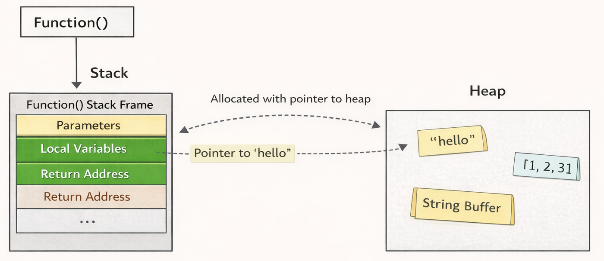

This chapter covers arguably the most important concept in Rust: **ownership**.

A simple way to think about ownership is:
> “Who owns this value right now, and what are others allowed to do with it?”

Rust’s goal is to make memory safety automatic **without** a garbage collector that runs in the background.  

Instead, Rust uses ownership rules (checked at compile time) to decide **when memory can be freed** and **who is allowed to access it**.

Before we go deeper, it helps to review the **stack vs heap** model.  
If you already know these concepts, feel free to skim, but they matter a lot in Rust because ownership and borrowing often depend on *where data lives* and *how it is stored*.

---

## The Stack and the Heap

### Stack

In practice, the **stack** is best understood as a **region of memory** used for managing function calls.

It behaves *like* a LIFO (Last-In, First-Out) structure:
- when a function is called, a new chunk of stack memory is “pushed”
- when the function returns, that chunk is “popped”

Previously, we discussed how **functions** work at a high level.  

At the machine level, a function call is not “just jumping to code”, it also needs a place to store **call-specific state**.

That’s where the **stack frame** comes in.

When a function is called, the program allocates a **stack frame** (also called an *activation record*) on the stack.  
When the function returns, that stack frame is removed.

A stack frame typically stores things like:
- the **return address** (where execution should continue after the function finishes)
- **arguments** (depending on the calling convention)
- **local variables** that have a fixed, known size
- bookkeeping data (saved registers, alignment/padding, etc.)

<strong>
Why the stack matters in Rust
</strong>

Rust cares a lot about **predictability** and **explicitness**.

One key rule is:
- Values that live directly on the stack must have a **known, fixed size at compile time**

So “plain” fixed-size values often fit naturally on the stack:
- integers (`i32`, `u64`)
- booleans (`bool`)
- fixed-size arrays (`[i32; 3]`)
- tuples (as long as all parts are fixed-size)

However, many Rust values (like `String` and `Vec<T>`) *contain* a small fixed-size “header” that can live on the stack, **but the actual data they manage is stored on the heap**.

This distinction becomes critical once we start talking about ownership, moves, and borrowing.

---

### Heap

In contrast to the stack, the **heap** is used for data whose size is not known at compile time, or data that needs to live beyond a single stack frame.

The heap is not “worse” than stack by any means, it’s just a different tool:
- allocations can be **variable-sized**
- data can be **kept around** until you explicitly free it (or until Rust frees it for you)

---

#### What “allocating on the heap” means

Putting data on the heap (called **allocating**) looks roughly like this:

1. Your program **requests memory** from the system allocator (e.g., “I need N bytes”).
2. The allocator finds a free region of memory large enough.
3. The allocator **reserves** that region and returns an **address** (a pointer) to it.
4. Your program then **writes/copies** the data into that allocated space.

The important takeaway:

> The **address (pointer)** is a fixed-size value, so it can be stored cheaply (often on the stack), while the actual heap data lives elsewhere.

<strong>What’s the implication of “pointer on the stack, data on the heap”?</strong>

When a value “lives on the heap”, what you usually store in your local variable is **not the data itself**, but a small **handle** to it.

Think:

- **Stack**: small, fixed-size metadata (easy/fast to copy around)
- **Heap**: the actual contents (variable-sized)

This has a few practical implications:

#### 1) Copying the variable is usually cheap, but it does NOT copy the heap data
For types like `String` / `Vec<T>`, moving the variable typically moves only the handle
(pointer/len/capacity), not the entire buffer.

#### 2) Accessing heap data requires an extra indirection
To read or write the contents, the CPU follows the pointer to the heap.
This is why heap access can be slower than stack access (more pointer chasing, worse cache locality).

#### 3) Memory must be managed correctly
If heap data is allocated, someone must eventually free it.
Rust uses **ownership** rules to make sure:
- the data is freed exactly once
- no one uses it after it’s freed
- no two owners try to free the same allocation

This is the core motivation for Rust’s ownership system.

#### 4) “Size known at compile time” matters
Because the pointer/len/capacity are fixed-size, the handle can always live on the stack.
But the heap data can be variable-sized, which is why it goes to the heap in the first place.

#### 5) Why this is safer than C (same heap/stack, stricter rules)

`C` uses the same underlying idea (stack + heap), but the rules are different.

In `C`:
- You can freely copy pointers (aliases) to the same heap allocation.
- You manually call `free()`.
- That makes it easy to accidentally create:
  - **double-free**
  - **use-after-free**
  - **dangling pointers**
  - **data races** (in multithreaded code)

In safe Rust:
- Heap data has a clear **owner** responsible for freeing it (via `Drop`).
- Access is controlled by borrowing rules:
  - many shared borrows (`&T`) **or**
  - exactly one mutable borrow (`&mut T`)
- The compiler enforces these rules, so many “classic C memory bugs” become compile-time errors.

Note: Rust can still do “C-like” things via `unsafe`, but the default safe subset is designed to prevent these bugs.

So you often end up with a split like:
- **stack**: a small value (pointer + metadata like length/capacity)
- **heap**: the actual variable-sized contents

To access or modify heap data, the program follows the pointer to reach the heap memory.

---

## Stack vs Heap (quick comparison)

| Topic | Stack | Heap |
|---|---|---|
| What it’s for | Function-call state and fixed-size locals | Variable-sized data and data that may outlive a stack frame |
| Size known at compile time? | Yes (required) | Not necessarily |
| Allocation / deallocation | Automatic (push/pop via call/return) | Explicit via allocator (Rust automates via ownership/`Drop`) |
| Access cost | Very fast (direct) | Often involves indirection (follow a pointer) |
| Typical contents | `i32`, `bool`, fixed-size arrays, fixed-size structs/tuples | `String` buffer, `Vec<T>` buffer, `Box<T>` allocation, etc. |
| Lifetime intuition | Tied to the current scope / function frame | Can be independent of the current frame (as long as something owns it) |

> Common Rust pattern: the *handle* lives on the stack, while the *payload* lives on the heap.  
> Example: `String` is a small fixed-size struct (stack) pointing to a heap buffer (heap).
